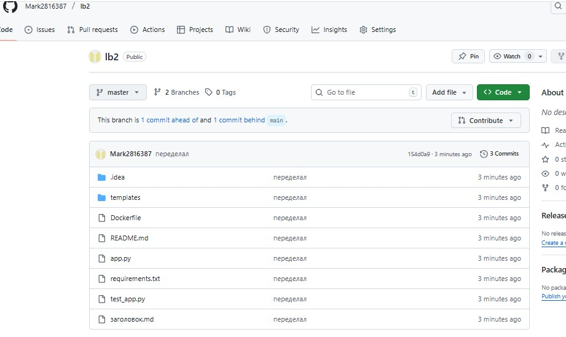
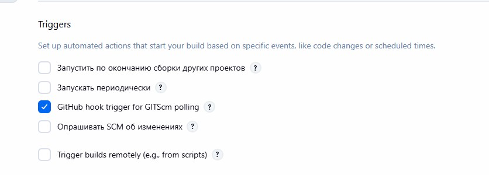
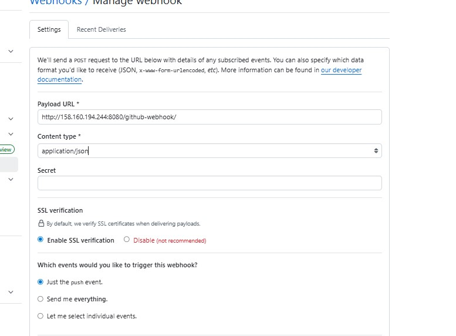
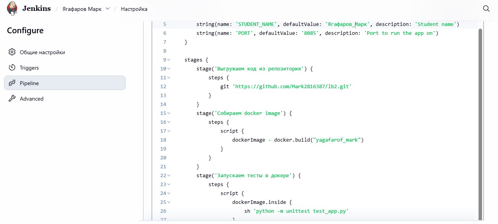
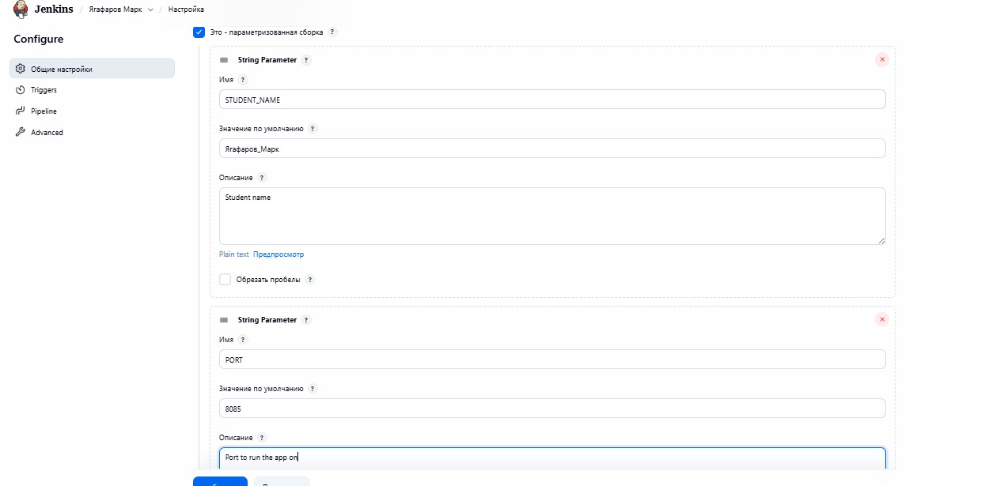
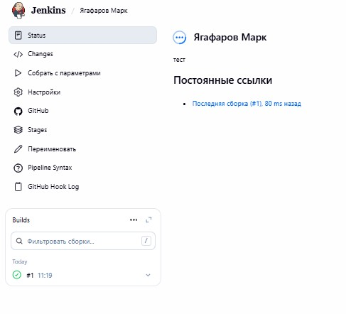
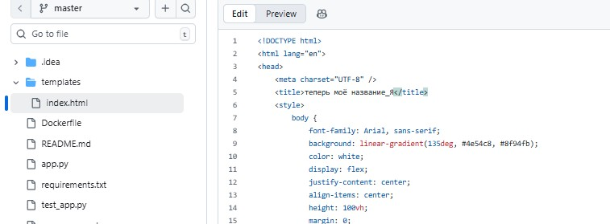
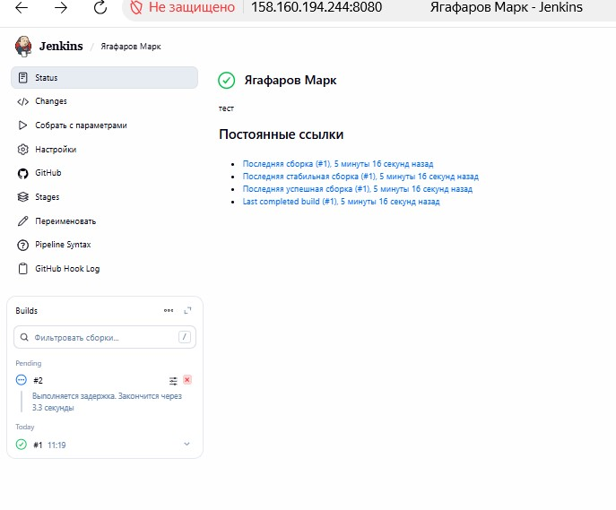

# lb2
выполнение связанно с jenkins
## отчёт
---

1. зашёл в jenkins

2. залогинелся

3. создал свой репозиторий и скопировал из методички данные

4. Создал в jenkins новый item зашёл в настройки и соединил его со своим github репозиторием

5. Поставил галочку на авто сбор при изменении в github

6. В github настроил его на адрес для jenkins порта

7. скопировал структуру Jenkinsfile и изменил по себя

8. Настроил свои параметры

9. собрал Jenkinsfile и запустил

---

10. Для проверки авто сборки изменил в github файл и увидел автообновление

